

<a href="https://owainwilliams.github.io/OwainWilliams/demo/"></a>


<!-- BLOG-POST-LIST:START -->
<a href="https://owain.codes/blog/2026/september/ai-as-a-learning-tool/"></a>
<a href="https://owain.codes/blog/2026/september/the-coffee-log-rebuilt-in-net/"></a>
<a href="https://owain.codes/blog/2026/september/time-to-reset/"></a>
<a href="https://owain.codes/blog/2026/september/initialsautolink/"></a>
<a href="https://owain.codes/blog/2026/july/a-reusable-deploy-pipeline-for-umbraco-cloud/"></a>
<!-- BLOG-POST-LIST:END -->



<!-- NUGET-LIST:START -->
<a href="https://www.nuget.org/packages/Umbraco.Community.MediaColourFinder"></a>
<a href="https://www.nuget.org/packages/oc.MultipleDatePicker"></a>
<a href="https://www.nuget.org/packages/OC.PowerSort"></a>
<a href="https://www.nuget.org/packages/OC.MediaColourFinderV2"></a>
<a href="https://www.nuget.org/packages/OC.UFMFallbacks"></a>
<a href="https://www.nuget.org/packages/OC.Automate.Mastodon"></a>
<a href="https://www.nuget.org/packages/OC.Automate.LinkedIn"></a>
<a href="https://www.nuget.org/packages/OC.MultiHotspot"></a>
<a href="https://www.nuget.org/packages/OC.Automate.Bluesky"></a>
<a href="https://www.nuget.org/packages/OC.HiddenDashboard"></a>
<a href="https://www.nuget.org/packages/ocTweetThis"></a>
<a href="https://www.nuget.org/packages/OC.UFMMemberLookup"></a>
<a href="https://www.nuget.org/packages/Initials.AutoLink"></a>
<!-- NUGET-LIST:END -->



<!-- BUTTONS:START -->
<a href="https://owain.codes"></a>
<a href="https://www.linkedin.com/in/owainwilliams/"></a>
<a href="https://umbracocommunity.social/@owaincodes"></a>
<a href="https://www.buymeacoffee.com/owaincodes"></a>
<!-- BUTTONS:END -->


